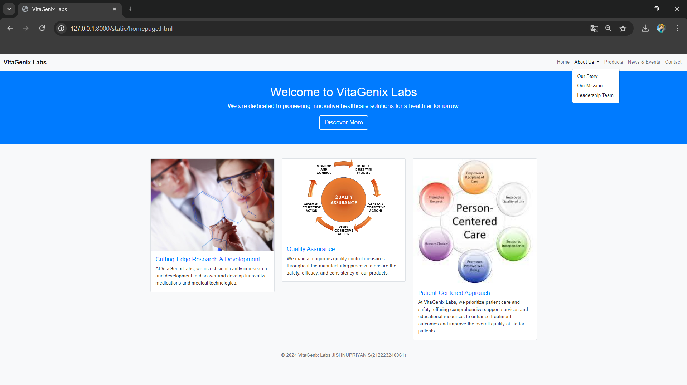
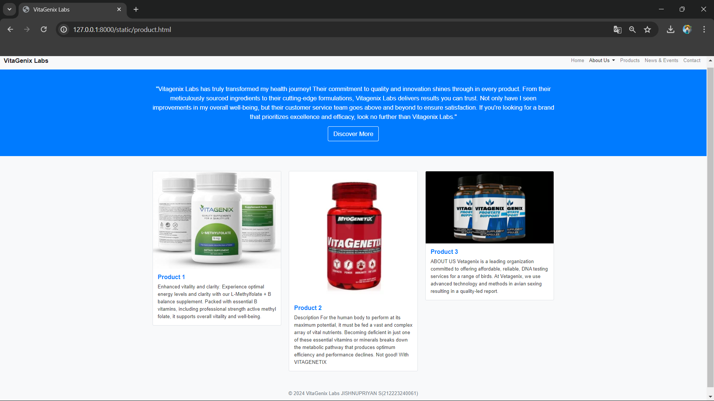
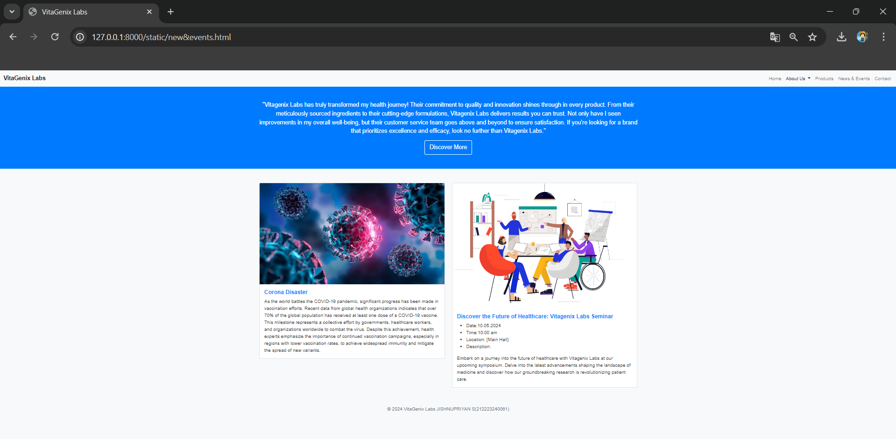
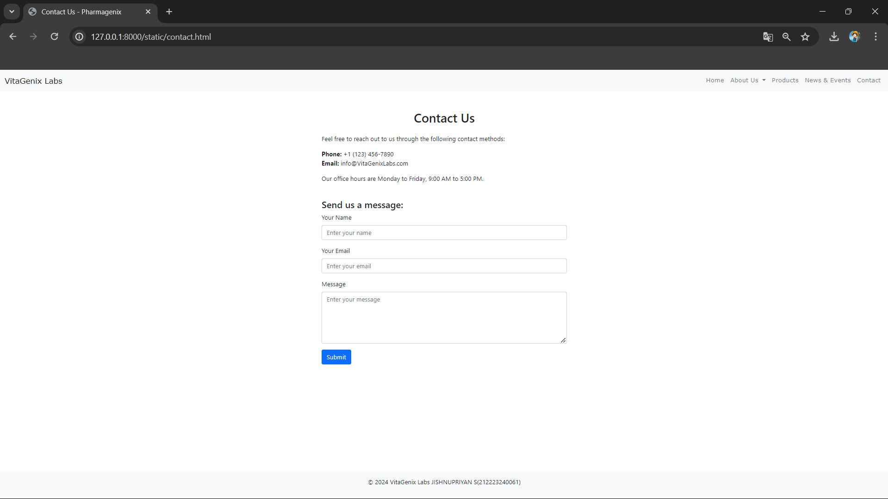

# Project Responsive Web Design using Bootstrap
## Date:10-5-2024

## AIM:
To design a responsive website for a Pharmaceutical Company using Bootstrap.


## DESIGN STEPS:

### Step 1:
Clone the repository from GitHub.

### Step 2:
Create Django Admin project.

### Step 3:
Create a New App under the Django Admin project.

### Step 4:
Insert the necessary CSS and JavaScript files as external in order to use Bootstrap.

### Step 5:
Create a HTML file and include the needed Bootstrap components.

### Step 6:
Publish the website in the LocalHost.

## PROGRAM :
## homepage.html
```
<!DOCTYPE html>
<html lang="en">
<head>
  <meta charset="UTF-8">
  <meta name="viewport" content="width=device-width, initial-scale=1.0">
  <title>VitaGenix Labs</title>
  <!-- Link to Bootstrap CSS -->
  <link rel="stylesheet" href="https://cdn.jsdelivr.net/npm/bootstrap@5.1.3/dist/css/bootstrap.min.css" integrity="sha384-1BmE4kWBq78iYhFldvKuhfTAU6auU8tT94WrHftjDbrCEXSU1oBoqyl2QvZ6jIW3" crossorigin="anonymous">
  <!-- Custom CSS -->
  <style>
    body {
      font-family: Arial, sans-serif;
      background-color: #f8f9fa; /* Light gray background */
      color: #333; /* Dark gray text color */
    }
    .navbar-brand {
      font-weight: bold;
      color: #007bff; /* Blue brand color */
    }
    .navbar-toggler-icon {
      background-color: #007bff; /* Blue toggle icon color */
    }
    .navbar-nav .nav-link {
      color: #333; /* Dark gray nav link color */
    }
    .hero {
      background-color: #007bff; /* Blue hero section background */
      color: #fff; /* White text color */
    }
    .hero a.btn-outline-primary {
      border-color: #fff; /* White button border color */
      color: #fff; /* White button text color */
    }
    .hero a.btn-outline-primary:hover {
      background-color: #fff; /* White button background on hover */
      color: #007bff; /* Blue button text color on hover */
    }
    .card {
      background-color: #fff; /* White card background */
      border: 1px solid #dee2e6; /* Light gray border */
    }
    .card-title {
      color: #007bff; /* Blue card title color */
    }
    .footer {
      background-color: #f8f9fa; /* Light gray footer background */
      color: #6c757d; /* Gray footer text color */
    }
  </style>
</head>
<body>

  <!-- Navigation Bar -->
  <nav class="navbar navbar-expand-lg navbar-light bg-light">
    <div class="container-fluid">
      <a class="navbar-brand" href="#">VitaGenix Labs</a>
      <button class="navbar-toggler" type="button" data-bs-toggle="collapse" data-bs-target="#navbarNav" aria-controls="navbarNav" aria-expanded="false" aria-label="Toggle navigation">
        <span class="navbar-toggler-icon"></span>
      </button>
      <div class="collapse navbar-collapse" id="navbarNav">
        <ul class="navbar-nav ms-auto">
          <li class="nav-item">
            <a class="nav-link" href="#">Home</a>
          </li>
          <li class="nav-item dropdown">
            <a class="nav-link dropdown-toggle active" href="#" id="aboutUsDropdown" role="button" data-bs-toggle="dropdown" aria-expanded="false">
              About Us
            </a>
            <ul class="dropdown-menu" aria-labelledby="aboutUsDropdown">
              <li><a class="dropdown-item" href="#">Our Story</a></li>
              <li><a class="dropdown-item" href="#">Our Mission</a></li>
              <li><a class="dropdown-item" href="#">Leadership Team</a></li>
            </ul>
          </li>
          <li class="nav-item">
            <a class="nav-link" href="product.html">Products</a>
          </li>
          <li class="nav-item">
            <a class="nav-link" href="new&events.html">News & Events</a>
          </li>
          <li class="nav-item">
            <a class="nav-link" href="contact.html">Contact</a>
          </li>
        </ul>
      </div>
    </div>
  </nav>

  <!-- Hero Section -->
  <section class="hero d-flex align-items-center justify-content-center text-center py-5 mb-5">
    <div class="container">
      <h1>Welcome to VitaGenix Labs</h1>
      <p class="lead">We are dedicated to pioneering innovative healthcare solutions for a healthier tomorrow.</p>
      <a href="#" class="btn btn-outline-primary btn-lg">Discover More</a>
    </div>
  </section>

  <!-- Features Section -->
  <section class="container">
    <div class="row">
      <div class="col-md-4 mb-4">
        <div class="card">
          
          <div class="card-body">
            <h5 class="card-title">Cutting-Edge Research & Development</h5>
            <p class="card-text">At VitaGenix Labs, we invest significantly in research and development to discover and develop innovative medications and medical technologies.</p>
          </div>
        </div>
      </div>
      <div class="col-md-4 mb-4">
        <div class="card">
          
          <div class="card-body">
            <h5 class="card-title">Quality Assurance</h5>
            <p class="card-text">We maintain rigorous quality control measures throughout the manufacturing process to ensure the safety, efficacy, and consistency of our products.</p>
         </div>
        </div>
      </div>
      <div class="col-md-4 mb-4">
        <div class="card">
          
          <div class="card-body">
            <h5 class="card-title">Patient-Centered Approach</h5>
            <p class="card-text">At VitaGenix Labs, we prioritize patient care and safety, offering comprehensive support services and educational resources to enhance treatment outcomes and improve the overall quality of life for patients.</p>
        </div>
        </div>
      </div>
    </div>
  </section>

  <!-- Footer Section -->
  <footer class="text-center py-3 footer">
    <p>&copy; 2024 VitaGenix Labs JISHNUPRIYAN S(212223240061)</p>
  </footer>

  <!-- Bootstrap Bundle JS -->
  <script src="https://cdn.jsdelivr.net/npm/bootstrap@5.1.3/dist/js/bootstrap.bundle.min.js" integrity="sha384-ka7Sk0Gln4gmtz2MlQnikT1wXgYsOg+OMhuP+IlRH9sENBO0LRn5q+8nbTov4+1p" crossorigin="anonymous"></script>
</body>
</html>
```

## product.html
```<!DOCTYPE html>
<html lang="en">
<head>
  <meta charset="UTF-8">
  <meta name="viewport" content="width=device-width, initial-scale=1.0">
  <title>VitaGenix Labs</title>
  <!-- Link to Bootstrap CSS -->
  <link rel="stylesheet" href="https://cdn.jsdelivr.net/npm/bootstrap@5.1.3/dist/css/bootstrap.min.css" integrity="sha384-1BmE4kWBq78iYhFldvKuhfTAU6auU8tT94WrHftjDbrCEXSU1oBoqyl2QvZ6jIW3" crossorigin="anonymous">
  <!-- Custom CSS -->
  <style>
    body {
      font-family: Arial, sans-serif;
      background-color: #f8f9fa; /* Light gray background */
      color: #333; /* Dark gray text color */
    }
    .navbar-brand {
      font-weight: bold;
      color: #007bff; /* Blue brand color */
    }
    .navbar-toggler-icon {
      background-color: #007bff; /* Blue toggle icon color */
    }
    .navbar-nav .nav-link {
      color: #333; /* Dark gray nav link color */
    }
    .hero {
      background-color: #007bff; /* Blue hero section background */
      color: #fff; /* White text color */
    }
    .hero a.btn-outline-primary {
      border-color: #fff; /* White button border color */
      color: #fff; /* White button text color */
    }
    .hero a.btn-outline-primary:hover {
      background-color: #fff; /* White button background on hover */
      color: #007bff; /* Blue button text color on hover */
    }
    .card {
      background-color: #fff; /* White card background */
      border: 1px solid #dee2e6; /* Light gray border */
    }
    .card-title {
      color: #007bff; /* Blue card title color */
    }
    .footer {
      background-color: #f8f9fa; /* Light gray footer background */
      color: #6c757d; /* Gray footer text color */
    }
    /* Product Card Style */
    .product-card {
      margin-bottom: 20px;
    }
    .product-card img {
      max-width: 100%;
      height: auto;
    }
    .product-card .card-title {
      font-size: 1.2rem;
      font-weight: bold;
    }
    .product-card .card-text {
      font-size: 1rem;
    }
  </style>
</head>
<body>

  <!-- Navigation Bar -->
  <nav class="navbar navbar-expand-lg navbar-light bg-light">
    <div class="container-fluid">
      <a class="navbar-brand" href="#">VitaGenix Labs</a>
      <button class="navbar-toggler" type="button" data-bs-toggle="collapse" data-bs-target="#navbarNav" aria-controls="navbarNav" aria-expanded="false" aria-label="Toggle navigation">
        <span class="navbar-toggler-icon"></span>
      </button>
      <div class="collapse navbar-collapse" id="navbarNav">
        <ul class="navbar-nav ms-auto">
          <li class="nav-item">
            <a class="nav-link" href="homepage.html">Home</a>
          </li>
          <li class="nav-item dropdown">
            <a class="nav-link dropdown-toggle active" href="#" id="aboutUsDropdown" role="button" data-bs-toggle="dropdown" aria-expanded="false">
              About Us
            </a>
            <ul class="dropdown-menu" aria-labelledby="aboutUsDropdown">
              <li><a class="dropdown-item" href="#">Our Story</a></li>
              <li><a class="dropdown-item" href="#">Our Mission</a></li>
              <li><a class="dropdown-item" href="#">Leadership Team</a></li>
            </ul>
          </li>
          <li class="nav-item">
            <a class="nav-link" href="product.html">Products</a>
          </li>
          <li class="nav-item">
            <a class="nav-link" href="new&events.html">News & Events</a>
          </li>
          <li class="nav-item">
            <a class="nav-link" href="contact.html">Contact</a>
          </li>
        </ul>
      </div>
    </div>
  </nav>

  <!-- Hero Section -->
  <section class="hero d-flex align-items-center justify-content-center text-center py-5 mb-5">
    <div class="container">
    
      <p class="lead">"Vitagenix Labs has truly transformed my health journey! Their commitment to quality and innovation shines through in every product. From their meticulously sourced ingredients to their cutting-edge formulations, Vitagenix Labs delivers results you can trust. Not only have I seen improvements in my overall well-being, but their customer service team goes above and beyond to ensure satisfaction. If you're looking for a brand that prioritizes excellence and efficacy, look no further than Vitagenix Labs."</p>
      <a href="#" class="btn btn-outline-primary btn-lg">Discover More</a>
    </div>
  </section>

  <!-- Products Section -->
  <section class="container">
    <div class="row">
      <div class="col-md-4 mb-4">
        <div class="card product-card">
          
          <div class="card-body">
            <h5 class="card-title">Product 1</h5>
            <p class="card-text">Enhanced vitality and clarity: Experience optimal energy levels and clarity with our L-Methylfolate + B balance supplement. Packed with essential B vitamins, including professional strength active methyl folate, it supports overall vitality and well-being.</p>
          </div>
        </div>
      </div>
      <div class="col-md-4 mb-4">
        <div class="card product-card">
          
          <div class="card-body">
            <h5 class="card-title">Product 2</h5>
            <p class="card-text">Description For the human body to perform at its maximum potential, it must be fed a vast and complex array of vital nutrients. Becoming deficient in just one of these essential vitamins or minerals breaks down the metabolic pathway that produces optimum efficiency and performance declines. Not good! With VITAGENETIX</p>
          </div>
        </div>
      </div>
      <div class="col-md-4 mb-4">
        <div class="card product-card">
          
          <div class="card-body">
            <h5 class="card-title">Product 3</h5>
            <p class="card-text">ABOUT US
                Vetagenix is a leading organization committed to offering affordable, reliable, DNA testing services for a range of birds. At Vetagenix, we use advanced technology and methods in avian sexing resulting in a quality-led report.</p>
          </div>
        </div>
      </div>
    </div>
  </section>

  <!-- Footer Section -->
  <footer class="text-center py-3 footer">
    <p>&copy; 2024 VitaGenix Labs JISHNUPRIYAN S(212223240061)</p>
  </footer>

  <!-- Bootstrap Bundle JS -->
  <script src="https://cdn.jsdelivr.net/npm/bootstrap@5.1.3/dist/js/bootstrap.bundle.min.js" integrity="sha384-ka7Sk0Gln4gmtz2MlQnikT1wXgYsOg+OMhuP+IlRH9sENBO0LRn5q+8nbTov4+1p" crossorigin="anonymous"></script>
</body>
</html>
```

## new$events.html
```
<!DOCTYPE html>
<html lang="en">
<head>
  <meta charset="UTF-8">
  <meta name="viewport" content="width=device-width, initial-scale=1.0">
  <title>VitaGenix Labs</title>
  <!-- Link to Bootstrap CSS -->
  <link rel="stylesheet" href="https://cdn.jsdelivr.net/npm/bootstrap@5.1.3/dist/css/bootstrap.min.css" integrity="sha384-1BmE4kWBq78iYhFldvKuhfTAU6auU8tT94WrHftjDbrCEXSU1oBoqyl2QvZ6jIW3" crossorigin="anonymous">
  <!-- Custom CSS -->
  <style>
    body {
      font-family: Arial, sans-serif;
      background-color: #f8f9fa; /* Light gray background */
      color: #333; /* Dark gray text color */
    }
    .navbar-brand {
      font-weight: bold;
      color: #007bff; /* Blue brand color */
    }
    .navbar-toggler-icon {
      background-color: #007bff; /* Blue toggle icon color */
    }
    .navbar-nav .nav-link {
      color: #333; /* Dark gray nav link color */
    }
    .hero {
      background-color: #007bff; /* Blue hero section background */
      color: #fff; /* White text color */
    }
    .hero a.btn-outline-primary {
      border-color: #fff; /* White button border color */
      color: #fff; /* White button text color */
    }
    .hero a.btn-outline-primary:hover {
      background-color: #fff; /* White button background on hover */
      color: #007bff; /* Blue button text color on hover */
    }
    .card {
      background-color: #fff; /* White card background */
      border: 1px solid #dee2e6; /* Light gray border */
    }
    .card-title {
      color: #007bff; /* Blue card title color */
    }
    .footer {
      background-color: #f8f9fa; /* Light gray footer background */
      color: #6c757d; /* Gray footer text color */
    }
    /* Product Card Style */
    .product-card {
      margin-bottom: 20px;
    }
    .product-card img {
      max-width: 100%;
      height: auto;
    }
    .product-card .card-title {
      font-size: 1.2rem;
      font-weight: bold;
    }
    .product-card .card-text {
      font-size: 1rem;
    }
    /* News and Events Card Style */
    .news-event-card {
      margin-bottom: 20px;
    }
    .news-event-card img {
      max-width: 100%;
      height: auto;
    }
    .news-event-card .card-title {
      font-size: 1.2rem;
      font-weight: bold;
    }
    .news-event-card .card-text {
      font-size: 1rem;
    }
  </style>
</head>
<body>

  <!-- Navigation Bar -->
  <nav class="navbar navbar-expand-lg navbar-light bg-light">
    <div class="container-fluid">
      <a class="navbar-brand" href="#">VitaGenix Labs</a>
      <button class="navbar-toggler" type="button" data-bs-toggle="collapse" data-bs-target="#navbarNav" aria-controls="navbarNav" aria-expanded="false" aria-label="Toggle navigation">
        <span class="navbar-toggler-icon"></span>
      </button>
      <div class="collapse navbar-collapse" id="navbarNav">
        <ul class="navbar-nav ms-auto">
          <li class="nav-item">
            <a class="nav-link" href="homepage.html">Home</a>
          </li>
          <li class="nav-item dropdown">
            <a class="nav-link dropdown-toggle active" href="#" id="aboutUsDropdown" role="button" data-bs-toggle="dropdown" aria-expanded="false">
              About Us
            </a>
            <ul class="dropdown-menu" aria-labelledby="aboutUsDropdown">
              <li><a class="dropdown-item" href="#">Our Story</a></li>
              <li><a class="dropdown-item" href="#">Our Mission</a></li>
              <li><a class="dropdown-item" href="#">Leadership Team</a></li>
            </ul>
          </li>
          <li class="nav-item">
            <a class="nav-link" href="product.html">Products</a>
          </li>
          <li class="nav-item">
            <a class="nav-link" href="new&events.html">News & Events</a>
          </li>
          <li class="nav-item">
            <a class="nav-link" href="contact.html">Contact</a>
          </li>
        </ul>
      </div>
    </div>
  </nav>

  <!-- Hero Section -->
  <section class="hero d-flex align-items-center justify-content-center text-center py-5 mb-5">
    <div class="container">
    
      <p class="lead">"Vitagenix Labs has truly transformed my health journey! Their commitment to quality and innovation shines through in every product. From their meticulously sourced ingredients to their cutting-edge formulations, Vitagenix Labs delivers results you can trust. Not only have I seen improvements in my overall well-being, but their customer service team goes above and beyond to ensure satisfaction. If you're looking for a brand that prioritizes excellence and efficacy, look no further than Vitagenix Labs."</p>
      <a href="#" class="btn btn-outline-primary btn-lg">Discover More</a>
    </div>
  </section>

  
  <!-- News and Events Section -->
  <section class="container">
    <div class="row">
      <div class="col-md-6 mb-4">
        <div class="card news-event-card">
          
          <div class="card-body">
            <h5 class="card-title">Corona Disaster</h5>
            <p class="card-text">As the world battles the COVID-19 pandemic, significant progress has been made in vaccination efforts. Recent data from global health organizations indicates 
              that over 70% of the global population has received at least one dose of a COVID-19 vaccine. This milestone represents a 
              collective effort by governments, healthcare workers, and organizations worldwide to combat the virus. Despite this achievement, 
              health experts emphasize the importance of continued vaccination campaigns, especially in regions with lower vaccination rates, to achieve widespread immunity and mitigate the spread of new variants.</p>
          </div>
        </div>
      </div>
      <div class="col-md-6 mb-4">
        <div class="card news-event-card">
          
          <div class="card-body">
            <h5 class="card-title">Discover the Future of Healthcare: Vitagenix Labs Seminar</h5>
            <ul>
              <li>Date:10.05.2024
              </li>
              <li>Time:10:00 am</li>
              <li>Location: [Main Hall]

              </li>
              <li>Description:</li>
            </ul>
            <p class="card-text">
            
              Embark on a journey into the future of healthcare with Vitagenix Labs at our upcoming symposium. Delve into the latest advancements shaping the landscape of medicine and discover how our groundbreaking research is revolutionizing patient care.
            </p>
          </div>
        </div>
      </div>
    </div>
  </section>

  <!-- Footer Section -->
  <footer class="text-center py-3 footer">
    <p>&copy; 2024 VitaGenix Labs JISHNUPRIYAN S(212223240061)</p>
  </footer>

  <!-- Bootstrap Bundle JS -->
  <script src="https://cdn.jsdelivr.net/npm/bootstrap@5.1.3/dist/js/bootstrap.bundle.min.js" integrity="sha384-ka7Sk0Gln4gmtz2MlQnikT1wXgYsOg+OMhuP+IlRH9sENBO0LRn5q+8nbTov4+1p" crossorigin="anonymous"></script>
</body>
</html>
```

## contact.html
```
<!DOCTYPE html>
<html lang="en">
<head>
  <meta charset="UTF-8">
  <meta name="viewport" content="width=device-width, initial-scale=1.0">
  <title>Contact Us - Pharmagenix</title>
  <link rel="stylesheet" href="https://cdn.jsdelivr.net/npm/bootstrap@5.1.3/dist/css/bootstrap.min.css" integrity="sha384-1BmE4kWBq78iYhFldvKuhfTAU6auU8tT94WrHftjDbrCEXSU1oBoqyl2QvZ6jIW3" crossorigin="anonymous">
  <style>
    body nav {
      font-family:Verdana, Geneva, Tahoma, sans-serif
    }
  </style>
</head>
<body>

  <nav class="navbar navbar-expand-lg navbar-light bg-light">
    <div class="container-fluid">
      <a class="navbar-brand" href="#">VitaGenix Labs</a>
      <button class="navbar-toggler" type="button" data-bs-toggle="collapse" data-bs-target="#navbarNav" aria-controls="navbarNav" aria-expanded="false" aria-label="Toggle navigation">
        <span class="navbar-toggler-icon"></span>
      </button>
      <div class="collapse navbar-collapse" id="navbarNav">
        <ul class="navbar-nav ms-auto">
          <li class="nav-item">
            <a class="nav-link" href="homepage.html">Home</a>
          </li>
          <li class="nav-item dropdown">
            <a class="nav-link dropdown-toggle" href="#" id="aboutUsDropdown" role="button" data-bs-toggle="dropdown" aria-expanded="false">
              About Us
            </a>
            <ul class="dropdown-menu" aria-labelledby="aboutUsDropdown">
              <li><a class="dropdown-item" href="#">Our Story</a></li>
              <li><a class="dropdown-item" href="#">Our Mission</a></li>
              <li><a class="dropdown-item" href="#">Leadership Team</a></li>
            </ul>
          </li>
          <li class="nav-item">
            <a class="nav-link" href="product.html">Products</a>
          </li>
          <li class="nav-item">
            <a class="nav-link" href="new&events.html">News & Events</a>
          </li>
          <li class="nav-item active">
            <a class="nav-link" href="contact.html">Contact</a>
          </li>
        </ul>
      </div>
    </div>
  </nav>

  <section class="container mt-5">
    <h2 class="text-center mb-4">Contact Us</h2>
    <div class="row justify-content-center">
      <div class="col-md-6">
        <p>Feel free to reach out to us through the following contact methods:</p>
        <ul class="list-unstyled">
          <li><strong>Phone:</strong> +1 (123) 456-7890</li>
          <li><strong>Email:</strong> info@VitaGenixLabs.com</li>
        </ul>
        <p>Our office hours are Monday to Friday, 9:00 AM to 5:00 PM.</p>
      </div>
    </div>
    <div class="row justify-content-center mt-4">
      <div class="col-md-6">
        <h4>Send us a message:</h4>
        <form>
          <div class="mb-3">
            <label for="name" class="form-label">Your Name</label>
            <input type="text" class="form-control" id="name" placeholder="Enter your name">
          </div>
          <div class="mb-3">
            <label for="email" class="form-label">Your Email</label>
            <input type="email" class="form-control" id="email" placeholder="Enter your email">
          </div>
          <div class="mb-3">
            <label for="message" class="form-label">Message</label>
            <textarea class="form-control" id="message" rows="5" placeholder="Enter your message"></textarea>
          </div>
          <button type="submit" class="btn btn-primary">Submit</button>
        </form>
      </div>
    </div>
  </section>

  <footer class="text-center py-3 bg-light fixed-bottom">
    <p>&copy; 2024 VitaGenix Labs JISHNUPRIYAN S(212223240061)</p>
  </footer>

  <script src="https://cdn.jsdelivr.net/npm/bootstrap@5.1.3/dist/js/bootstrap.bundle.min.js" integrity="sha384-ka7Sk0Gln4gmtz2MlQnikT1wXgYsOg+OMhuP+IlRH9sENBO0LRn5q+8nbTov4+1p" crossorigin="anonymous"></script>
</body>
</html>
```
## OUTPUT:
## homeage.html

## product.html

## new&events.html

## contact.html

## RESULT:
The Project for responsive web design using Bootstrap is completed successfully.
